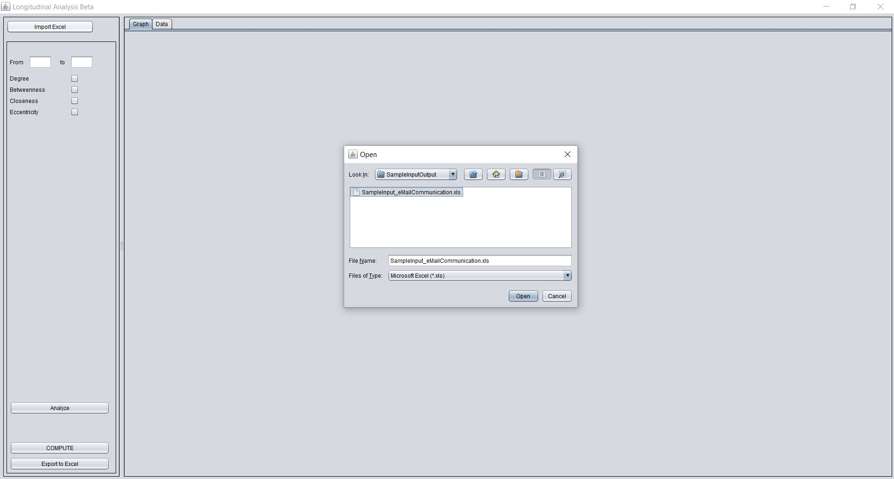
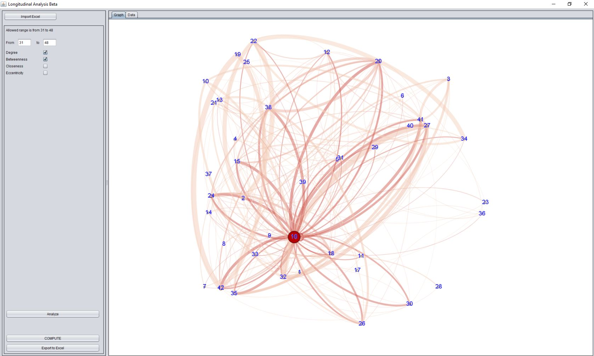
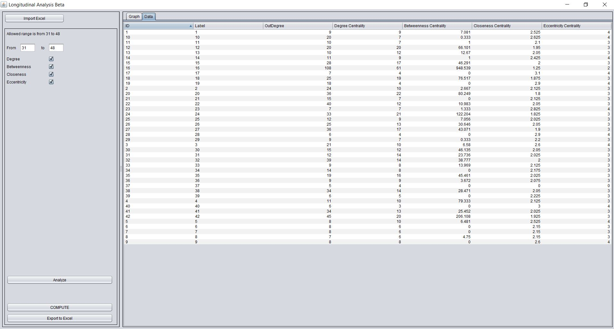

# Longitudinal Social Network Analysis

## Description
This is a graphical software to analyse longitudinal social network (actor's participation) over time. It has two primary purposes - ***a)*** Calculate different SNA matrices over a certain period of time and ***b)*** Visualise the graph for that particular period of time (highlighting actors with higher degree centralities).

It takes input from an Excel file and can save the current output as an Excel file as well. Also, the user can adjust the time window and choose from certain network matrices.

## Important information
**Author:** Dr Arif Khan 
**Supervisor:** Dr Shahadat Uddin 
**Language:** Java 
**Built Year:** 2013 
**Libraries used:** [Gephi Toolkit](https://gephi.org/toolkit/), [JXL API](http://jexcelapi.sourceforge.net/) 
**License:** MIT

## How to Run
You should have JRE properly installed. Then just double click *SNA.jar* in the *dist* folder to run it. The documentation below is based on this JRE file. Alternatively, you can build the solution yourself from the source code and run it.

## Input
A sample input file is provided in the *SampleInputOutput* folder (*Sid* = sender ID, *Rid* = Receiver ID, *Week* = time of interaction). The input file should be an Excel file with a *.xls* format containing the edge list. The first row should be the header. Data starts from the second row and the first blank row signals the end of input. All cells within the data rows must be valid and not empty. The data should reside in the first worksheet.

There are three data columns in each row. First column indicates the source node ID (*integer*), second column indicates the target node ID (*integer*), the third column indicates the time (*integer*) in which the interaction happened. Each data row indicates only one interaction at a certain time (that's why there is no column for ***weight***). However, if there are multiple interactions in a single time frame, you can repeat the same row to account for the overall interactions. For example, if a node ID 32 interacts with node ID 36 for 4 times in timeframe 10, then you need to make *4* rows - each will have *32*,*36*,*10* (in order) in the three columns.

## Operation and Output
This is quite intuitive. Put the necessary timeframe during which you want to compute the matrices. First, click the ***Import Excel*** button to import the data file (you can use the sample input file provided). Then, select/tick the necessary matrices (*degree, betweenness, closeness, eccentricity*. Select the ***Graph*** or ***Data*** Tab to toggle between visualisation or the Data. Click ***COMPUTE*** to process the data. Click ***Export to Excel*** to export the current calculation (see the Data tab for what is going to be saved) in an Excel file. *Note:* If you build from the source code, the GUI might be different then the current SNA.jar file in the dist folder. Also, if you want some further understanding of the calculation process or graph matrices, please read the reference articles below. 
If you have issues, you can email me (arif.khan@sydney.edu.au).

## References
1. **Uddin, S.**, **Khan, A.** and **Piraveenan, M.** A set of measures to quantify the dynamicity of longitudinal social networks. *Complexity*. (Impact Factor: 3.514)
2.	**Uddin, S.**, **Piraveenan, M.**, **Khan, A.** and **Amiri, B.**, *Conceptual quantification of the dynamicity of longitudinal social networks*. in International Conference on Social Computing (SocialCom), 2013, IEEE, 868-873.

## Screenshots
**Home Screen and File Open Dialog**

**Graph Representation**

**Data Representation**

